**Note:** For the screenshots, you can store all of your answer images in the `answer-img` directory.

## Verify the monitoring installation
~~*TODO:* run `kubectl` command to show the running pods and services for all components. Take a screenshot of the output and include it here to verify the installation~~

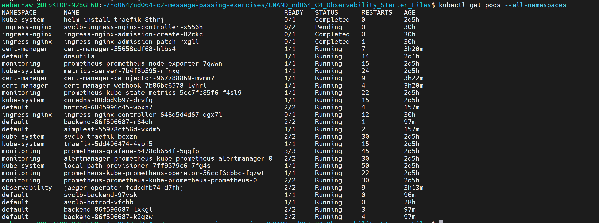 
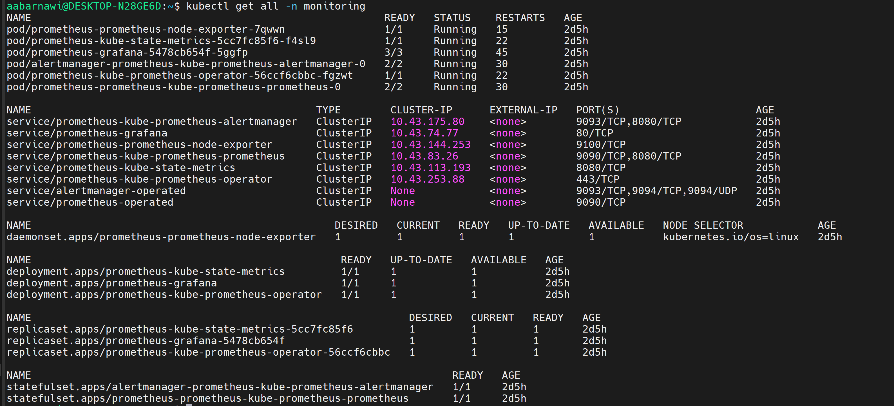 

## Setup the Jaeger and Prometheus source
~~*TODO:* Expose Grafana to the internet and then setup Prometheus as a data source. Provide a screenshot of the home page after logging into Grafana.~~

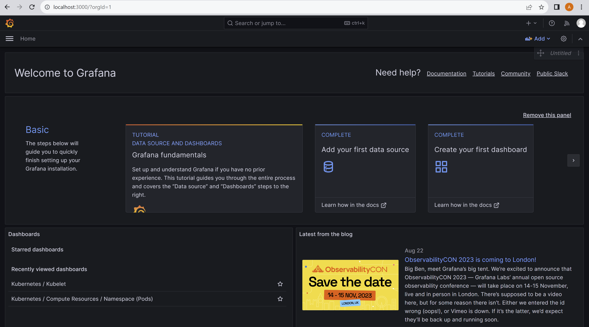

## Create a Basic Dashboard
~~*TODO:* Create a dashboard in Grafana that shows Prometheus as a source. Take a screenshot and include it here.~~

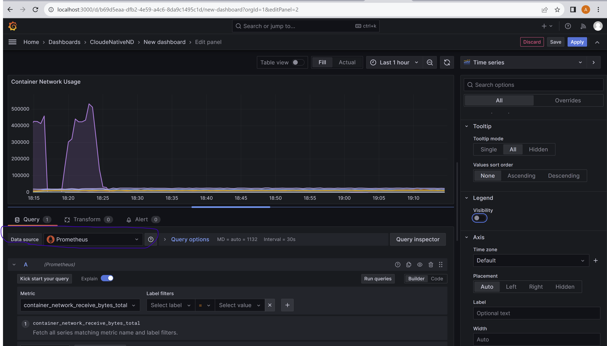

## Describe SLO/SLI
~~*TODO:* Describe, in your own words, what the SLIs are, based on an SLO of *monthly uptime* and *request response time*.~~ 
#### Request Response Time SLI's :
1- Number of milliseconds for each request (to measure latency which is directly related to response time) 
2- Number of HTTP requests/second. (to measure traffic, which can affect the request response time) 
3-Memory Usage (to make sure its whithin acceptable range, too high means service might be taking too much time to process requests, hence the requests are beeing accumulated in the meory) 

#### Monthly Uptime SLI's :
1-Number of timed out requests/hour (to measure the availability of the service) 
2-Number of HTTP 500 responses/hour (to measure the correctness of the service) 
3-Number of HTTP 400 responses/hour (having this is a system is normal, but when the number becomes too hight, it becomes an indicator that some service might be not working properly) 
4-CPU Usage (to make sure its whithin acceptable range, to low means service might not be up, too high means service might crash) 
5-Memory Usage (to make sure its whithin acceptable range, too high means service might not be up, while too high means the service might crash) 
6-Percentage of success resopone of the /health endpoint (we can set this to 95%+ per month for 95% uptime per month) 

## Creating SLI metrics.
~~*TODO:* It is important to know why we want to measure certain metrics for our customer. Describe in detail 5 metrics to measure these SLIs.~~ 

1- Total time of network requests is importnant to figure out the latency in requests and the response time per request. 
2- HTTP Traffic allows us to measure the traffic, which if became higher than what the server an handle, will affect the response time. 
3- Number of HTTP 500 responses allows us to know when the service starts acting abnormaly. 
4- Timed out requests informs us that their might be a network issue, or somthing wrong the service. 
5- Health endpoint response is a very good indicator to weather a service is healthy or not, and should be used as an indicater for the service. 

## Create a Dashboard to measure our SLIs
~~*TODO:* Create a dashboard to measure the uptime of the frontend and backend services We will also want to measure to measure 40x and 50x errors. Create a dashboard that show these values over a 24 hour period and take a screenshot.~~

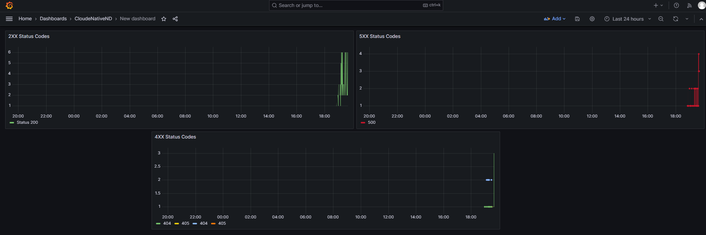

## Tracing our Flask App
~~*TODO:*  We will create a Jaeger span to measure the processes on the backend. Once you fill in the span, provide a screenshot of it here. Also provide a (screenshot) sample Python file containing a trace and span code used to perform Jaeger traces on the backend service.~~

### Sucessfull Trace
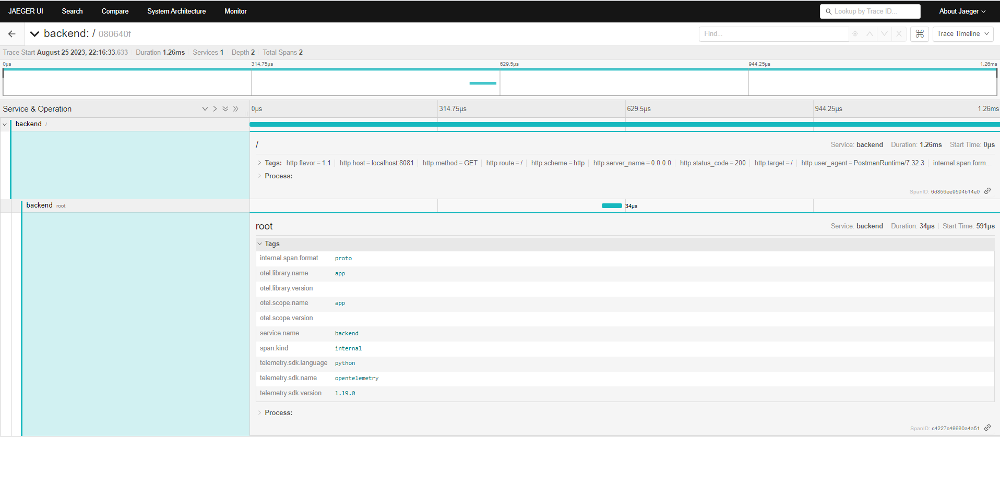
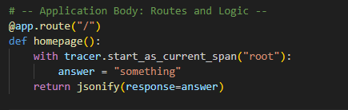

### Error Trace
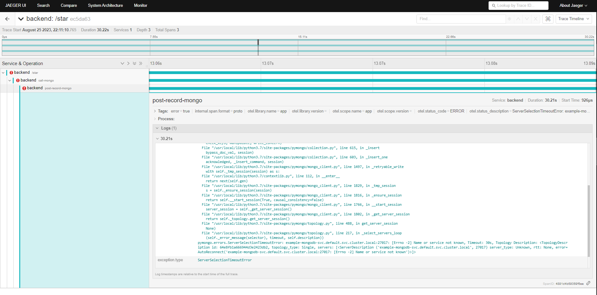
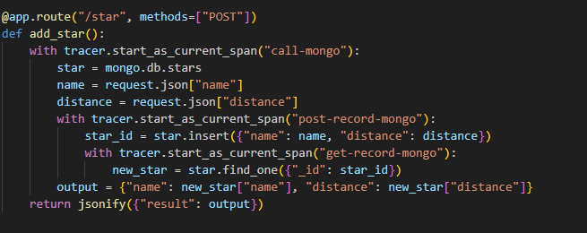

## Jaeger in Dashboards
~~*TODO:* Now that the trace is running, let's add the metric to our current Grafana dashboard. Once this is completed, provide a screenshot of it here.~~
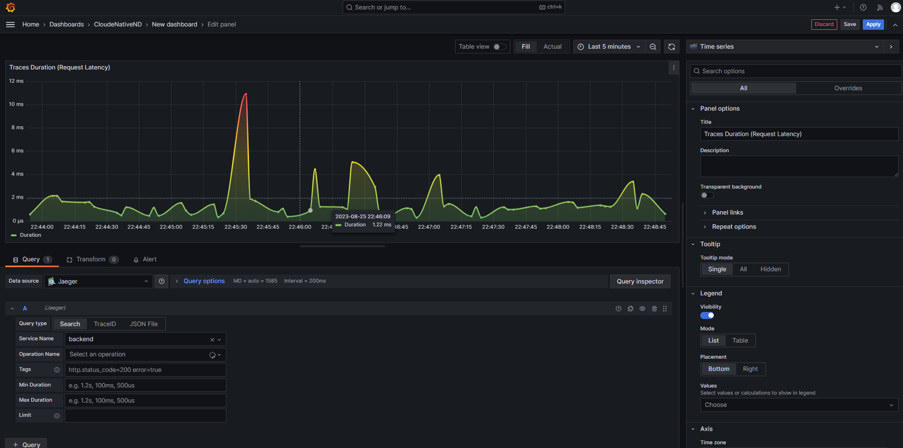

## Report Error
~~*TODO:* Using the template below, write a trouble ticket for the developers, to explain the errors that you are seeing (400, 500, latency) and to let them know the file that is causing the issue also include a screenshot of the tracer span to demonstrate how we can user a tracer to locate errors easily.~~
TROUBLE TICKET

Name: Internal server error

Date: August 25, 2023, 20:51:54.618

Subject: Backend Internal service error

Affected Area: Backend

Severity: High

Description: Backend is throwing an timout error at the endpoint /star1, the trace shows that the mongodb backend is not reachable, please refer to the trace image below. 

## Creating SLIs and SLOs
~~*TODO:* We want to create an SLO guaranteeing that our application has a 99.95% uptime per month. Name four SLIs that you would use to measure the success of this SLO.~~
CPU Usage: Given the average used rate, we can predict and prevent errors by measuing abnormal values of the CPU  
Memory Usage:  Given the average used rate, we can also predict and prevent errors by measuing abnormal values of the Meomry  
Failed HTTP Requests : The number of failed requests in a given timeframe is a good indication of abnormality in the application  
Number of timed out requests: If this metric is higher than the average, we know some service in the applicatoin is not up  
Error budget: The amount of downtime that is acceptable for an application. A 99.95% uptime SLO corresponds to an error budget of 0.05%, or 5 minutes per month. 

## Building KPIs for our plan
~~*TODO*: Now that we have our SLIs and SLOs, create a list of 2-3 KPIs to accurately measure these metrics as well as a description of why those KPIs were chosen. We will make a dashboard for this, but first write them down here.~~
1-Memory and CPU usage should be whithin a range of 10% of the average usage per month. Lower than average indicates that the service might be down, while higher than average can let us know that there is high load, so intervention is needed to prevent downtim due to high load. 
2- Failed HTTP requests should  not exceed < delta > requests per hour. The delta will be chosen after the application is monitored in its best state. 

## Final Dashboard
~~*TODO*: Create a Dashboard containing graphs that capture all the metrics of your KPIs and adequately representing your SLIs and SLOs. Include a screenshot of the dashboard here, and write a text description of what graphs are represented in the dashboard.~~
Uptime graph: measrues the uptime of the backend service 
Traces With Duration: Lists the traces and their durations, where the high durations are shown in red, this is good for showing the latency and pointing out timed out requests. 
The other 3 graphs show the 2xx,4xx and 5xx status codes. which is an important indicator for the services correctness 

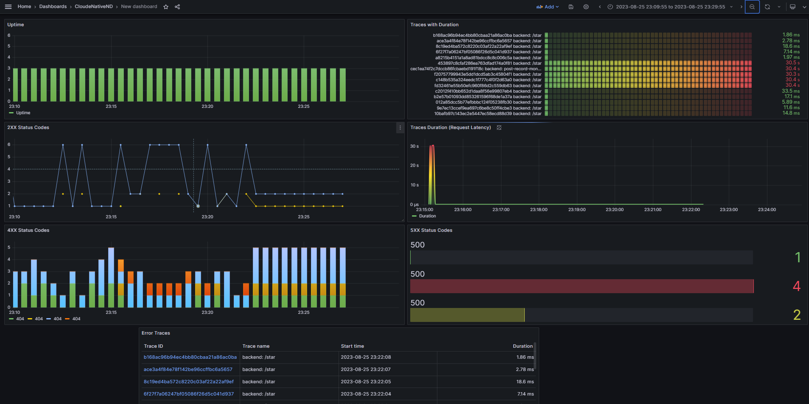  
